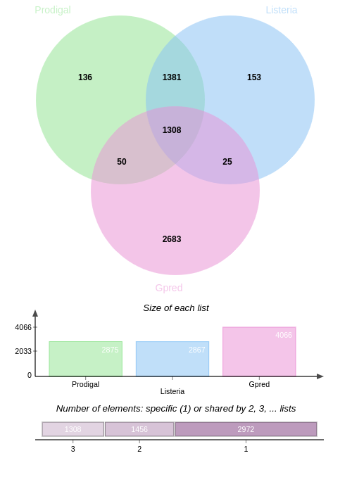

# GenePred-Listeria 🧬


## Overview
This project is a fork of the original repository [geneprediction-tp](https://github.com/aghozlane/geneprediction-tp), aimed at developing a program to predict prokaryotic genes based on the detection of reading frames and the Shine-Dalgarno motif, which is crucial for initiating protein translation. The Shine-Dalgarno sequence, AGGAGGUAA, binds to the 16S rRNA subunit to initiate translation, as described by [Shine and Dalgarno in 1973](https://www.sciencedirect.com/science/article/pii/0022283673905287). Above is a diagram showing the Shine-Dalgarno sequence in relation to the start codon AUG.

<div  align="center">
  
</div>


We focused on the referencegenome of the bacterium [Listeria monocytogenes EGD-e](https://www.ncbi.nlm.nih.gov/genome/browse/#!/proteins/159/159660%7CListeria%20monocytogenes%20EGD-e/) (assembled and sequenced by the Institut Pasteur), which presents 2867 genes. 

The program will:

1. **Read the Genome Sequence**: Load the genome sequence from the input FASTA file.

2. **Identify Potential Genes**: 
- Detect start and stop codons using regex.
- Search for Shine-Dalgarno motifs upstream of start codons.

3. **Validate Genes**: Ensure the gene length meets the minimum threshold and respect the gap between genes.

4. **Process the Reverse Complement**: Analyze the reverse complement sequence and adjust gene coordinates accordingly.

5. **Output Predictions**: Save predicted gene positions for both strands in a CSV file for comparison with reference data.


## Usage 💻
### Installation
To run the programm, you need to install the following dependencies:
```
pip install loguru regex
```

### Running the Gene Prediction
The Gene Prediction can be run using the following command:

```
python gpred/gpred.py -i [genome_file] -g [min_gene_len] -s [max_shine_dalgarno_distance] -d [min_gap] -p [predicted_genes_file] -o [fasta_output_file]
```

Options :

 - `-i`, -genome_file : The path to the genome file in FASTA format.
 - `-g`, -min_gene_len : The minimum gene length (optional - default value 50)
 - `-s`, -max_shine_dalgarno_distance : The maximum distance between the start codon and the Shine-Dalgarno sequence (optional - default value 16)
 - `-d`, -min_gap : The minimum gap between two genes (optional - default value 40)
 - `-p`, -predicted_genes_file : The path to the output file containing the predicted genes.
 - `-o`, -fasta_output_file : The path to the output file containing the predicted genes in FASTA format.


Example :
```
python gpred/gpred.py -i data/listeria.fna -p results/predicted_genes_positions.csv -o results/predicted_genes.fasta
```


This command will predict genes in the Listeria genome file [`data/listeria.fna`](https://github.com/Essmaw/GenePred-Listeria/blob/master/data/listeria.fna) with a minimum gene length of 50, a maximum distance of 16 between the start codon and the Shine-Dalgarno motif, a minimum gap of 40 between two genes, and will output the predicted genes and their positions in the files [`results/predicted_genes_positions.csv`](https://github.com/Essmaw/GenePred-Listeria/blob/master/results/predicted_genes_positions.csv) and [`results/predicted_genes.fasta`](https://github.com/Essmaw/GenePred-Listeria/blob/master/results/predicted_genes.fasta).


## Testing the results 🧪

To evaluate the accuracy of our predicted genes, we will compare them to a reference set of known genes. This comparison is done using [`jvenn`](https://jvenn.toulouse.inra.fr/app/example.html), an online tool for Venn diagram analysis, provided by INRA.

We will compare the predicted genes from our program with the reference genes from the `data/prodigal.csv` file that contains the genes predicted by the Prodigal software  and the `data/positions.csv` file that contains the positions of the reference genes in the Listeria genome.

<div   align="center">
  
</div>

- Intersection between the three sets → genes that are correctly predicted by our program and Prodigal.
- Intersection between Gpred + Prodigal → genes that are predicted by our program and Prodigal. 
- Intersection between Listeria + Prodigal → genes that are correctly predicted by Prodigal but not by our program. 
- Intersection between Listeria + Gpred → genes that are correctly predicted by our program but not by Prodigal.

We can see that using only shine dalgarno motif is not enough to predict all the genes correctly, but it can help to predict some genes that are not predicted by Prodigal.


## Author 🧑‍💻
- [Essmay Touami](essmay.touami@etu.u-paris.fr)